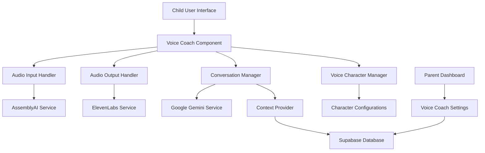
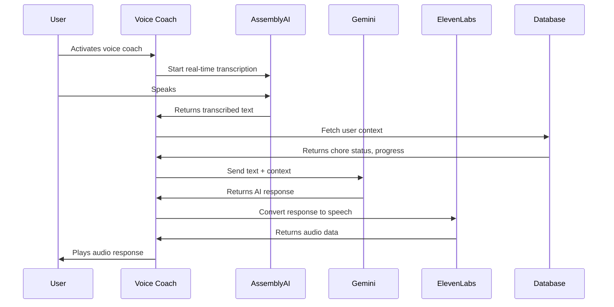

# AI Voice Coach Design Document

## Overview

The AI Voice Coach is a conversational interface that combines real-time speech processing with contextual AI responses to provide children with an engaging, personalized coaching experience. The system integrates three key services: AssemblyAI for speech-to-text, Google Gemini for intelligent response generation, and ElevenLabs for natural-sounding text-to-speech synthesis.

## Architecture

### High-Level Architecture



### Service Integration Flow



## Components and Interfaces

### 1. Voice Coach Component (`components/VoiceCoach.tsx`)

Main React component that orchestrates the voice interaction experience.

```typescript
interface VoiceCoachProps {
  userId: string;
  isEnabled: boolean;
  selectedCharacter?: string;
  onInteractionComplete?: (interaction: VoiceInteraction) => void;
}

interface VoiceCoachState {
  isListening: boolean;
  isProcessing: boolean;
  isPlaying: boolean;
  currentTranscript: string;
  error?: string;
}
```

### 2. AssemblyAI Service (`lib/services/assemblyai.ts`)

Handles real-time speech-to-text conversion.

```typescript
interface AssemblyAIConfig {
  apiKey: string;
  sampleRate: number;
  wordBoost?: string[];
}

interface TranscriptionResult {
  text: string;
  confidence: number;
  isFinal: boolean;
}

class AssemblyAIService {
  startRealTimeTranscription(config: AssemblyAIConfig): Promise<WebSocket>;
  stopTranscription(): void;
  onTranscriptionResult(callback: (result: TranscriptionResult) => void): void;
}
```

### 3. Google Gemini Service (`lib/services/gemini.ts`)

Manages AI conversation and response generation.

```typescript
interface GeminiConfig {
  apiKey: string;
  model: string;
  temperature: number;
  maxTokens: number;
}

interface ConversationContext {
  userId: string;
  currentChores: Chore[];
  completedChores: Chore[];
  points: number;
  rank: string;
  recentAchievements: Achievement[];
}

interface GeminiResponse {
  text: string;
  confidence: number;
  usage: {
    promptTokens: number;
    completionTokens: number;
  };
}

class GeminiService {
  generateResponse(
    userInput: string, 
    context: ConversationContext,
    character: VoiceCharacter
  ): Promise<GeminiResponse>;
  
  buildSystemPrompt(character: VoiceCharacter): string;
}
```

### 4. ElevenLabs Service (`lib/services/elevenlabs.ts`)

Converts text responses to natural speech audio.

```typescript
interface ElevenLabsConfig {
  apiKey: string;
  voiceId: string;
  stability: number;
  similarityBoost: number;
}

interface VoiceCharacter {
  id: string;
  name: string;
  voiceId: string;
  personality: string;
  sampleRate: number;
}

interface AudioResult {
  audioData: ArrayBuffer;
  duration: number;
  format: string;
}

class ElevenLabsService {
  synthesizeSpeech(text: string, character: VoiceCharacter): Promise<AudioResult>;
  getAvailableVoices(): Promise<VoiceCharacter[]>;
  preloadCharacterVoices(characters: VoiceCharacter[]): Promise<void>;
}
```

### 5. Conversation Manager (`lib/conversation-manager.ts`)

Manages conversation state, context, and history.

```typescript
interface ConversationSession {
  id: string;
  userId: string;
  startTime: Date;
  interactions: VoiceInteraction[];
  context: ConversationContext;
}

interface VoiceInteraction {
  id: string;
  timestamp: Date;
  userInput: string;
  aiResponse: string;
  character: string;
  duration: number;
}

class ConversationManager {
  startSession(userId: string): Promise<ConversationSession>;
  addInteraction(sessionId: string, interaction: VoiceInteraction): Promise<void>;
  getSessionContext(sessionId: string): Promise<ConversationContext>;
  endSession(sessionId: string): Promise<void>;
}
```

### 6. Context Provider (`lib/context-provider.ts`)

Fetches and formats user context for AI responses.

```typescript
interface UserContext {
  profile: UserProfile;
  currentChores: Chore[];
  completedToday: Chore[];
  points: number;
  rank: RankInfo;
  streaks: StreakInfo;
  recentAchievements: Achievement[];
}

class ContextProvider {
  getUserContext(userId: string): Promise<UserContext>;
  formatContextForAI(context: UserContext): ConversationContext;
  updateContextAfterInteraction(userId: string, interaction: VoiceInteraction): Promise<void>;
}
```

## Data Models

### Voice Coach Settings

```sql
CREATE TABLE voice_coach_settings (
  id UUID PRIMARY KEY DEFAULT gen_random_uuid(),
  user_id UUID REFERENCES auth.users(id) ON DELETE CASCADE,
  is_enabled BOOLEAN DEFAULT true,
  selected_character VARCHAR(50) DEFAULT 'friendly-guide',
  daily_limit_minutes INTEGER DEFAULT 30,
  usage_today INTEGER DEFAULT 0,
  last_reset_date DATE DEFAULT CURRENT_DATE,
  created_at TIMESTAMP WITH TIME ZONE DEFAULT NOW(),
  updated_at TIMESTAMP WITH TIME ZONE DEFAULT NOW()
);
```

### Conversation Sessions

```sql
CREATE TABLE conversation_sessions (
  id UUID PRIMARY KEY DEFAULT gen_random_uuid(),
  user_id UUID REFERENCES auth.users(id) ON DELETE CASCADE,
  start_time TIMESTAMP WITH TIME ZONE DEFAULT NOW(),
  end_time TIMESTAMP WITH TIME ZONE,
  total_interactions INTEGER DEFAULT 0,
  total_duration INTEGER DEFAULT 0,
  character_used VARCHAR(50),
  created_at TIMESTAMP WITH TIME ZONE DEFAULT NOW()
);
```

### Voice Interactions

```sql
CREATE TABLE voice_interactions (
  id UUID PRIMARY KEY DEFAULT gen_random_uuid(),
  session_id UUID REFERENCES conversation_sessions(id) ON DELETE CASCADE,
  user_input TEXT NOT NULL,
  ai_response TEXT NOT NULL,
  character VARCHAR(50) NOT NULL,
  duration INTEGER NOT NULL,
  confidence_score DECIMAL(3,2),
  timestamp TIMESTAMP WITH TIME ZONE DEFAULT NOW()
);
```

### Voice Characters Configuration

```sql
CREATE TABLE voice_characters (
  id VARCHAR(50) PRIMARY KEY,
  name VARCHAR(100) NOT NULL,
  description TEXT,
  elevenlabs_voice_id VARCHAR(100) NOT NULL,
  personality_prompt TEXT NOT NULL,
  is_active BOOLEAN DEFAULT true,
  age_appropriate BOOLEAN DEFAULT true,
  created_at TIMESTAMP WITH TIME ZONE DEFAULT NOW()
);
```

## Error Handling

### Service Fallback Strategy

1. **AssemblyAI Failure**: Fall back to browser's Web Speech API if available
2. **Gemini Failure**: Use pre-configured encouraging responses based on context
3. **ElevenLabs Failure**: Display text response with option to read aloud using browser TTS
4. **Network Issues**: Cache recent responses for offline encouragement

### Error Recovery Patterns

```typescript
class ServiceErrorHandler {
  async handleAssemblyAIError(error: Error): Promise<TranscriptionResult> {
    // Log error and attempt browser fallback
    if (this.isBrowserSpeechAvailable()) {
      return this.useBrowserSpeechRecognition();
    }
    throw new VoiceCoachError('Speech recognition unavailable');
  }
  
  async handleGeminiError(error: Error, context: ConversationContext): Promise<string> {
    // Return contextual fallback response
    return this.getFallbackResponse(context);
  }
  
  async handleElevenLabsError(error: Error, text: string): Promise<AudioResult> {
    // Attempt browser TTS fallback
    return this.useBrowserTextToSpeech(text);
  }
}
```

## Testing Strategy

### Unit Tests

1. **Service Layer Tests**
   - Mock API responses for AssemblyAI, Gemini, and ElevenLabs
   - Test error handling and fallback mechanisms
   - Validate audio processing and playback

2. **Component Tests**
   - Test voice coach UI state management
   - Verify proper error display and recovery
   - Test character selection and settings

3. **Integration Tests**
   - Test complete voice interaction flow
   - Verify context loading and AI response generation
   - Test conversation session management

### End-to-End Tests

1. **Voice Interaction Flow**
   - Record test audio and verify transcription
   - Test AI response generation with mock context
   - Verify audio playback functionality

2. **Character Selection**
   - Test switching between voice characters
   - Verify character-specific responses
   - Test character settings persistence

3. **Parent Controls**
   - Test enabling/disabling voice coach
   - Verify usage limit enforcement
   - Test settings synchronization

### Performance Tests

1. **Latency Testing**
   - Measure speech-to-text response time
   - Test AI response generation speed
   - Verify text-to-speech conversion time

2. **Resource Usage**
   - Monitor memory usage during long conversations
   - Test audio buffer management
   - Verify proper cleanup of resources

### Security Tests

1. **API Key Protection**
   - Verify API keys are not exposed in client code
   - Test secure server-side API calls
   - Validate environment variable handling

2. **Data Privacy**
   - Test conversation data encryption
   - Verify user data is not sent to unauthorized services
   - Test proper data retention policies

## Configuration

### Environment Variables

```env
# Google Gemini
GOOGLE_GEMINI_API_KEY=your_gemini_api_key
GEMINI_MODEL=gemini-pro
GEMINI_TEMPERATURE=0.7
GEMINI_MAX_TOKENS=150

# AssemblyAI
ASSEMBLYAI_API_KEY=your_assemblyai_api_key
ASSEMBLYAI_SAMPLE_RATE=16000

# ElevenLabs
ELEVENLABS_API_KEY=your_elevenlabs_api_key
ELEVENLABS_MODEL=eleven_monolingual_v1

# Voice Coach Settings
VOICE_COACH_DEFAULT_CHARACTER=friendly-guide
VOICE_COACH_MAX_SESSION_MINUTES=10
VOICE_COACH_DAILY_LIMIT_MINUTES=30
```

### Character Configurations

```json
{
  "characters": [
    {
      "id": "superhero",
      "name": "Captain Chore",
      "voiceId": "21m00Tcm4TlvDq8ikWAM",
      "personality": "Enthusiastic superhero who celebrates every achievement and encourages with heroic metaphors"
    },
    {
      "id": "robot",
      "name": "Robo-Helper",
      "voiceId": "AZnzlk1XvdvUeBnXmlld",
      "personality": "Friendly robot assistant with logical encouragement and systematic approach to tasks"
    },
    {
      "id": "friendly-guide",
      "name": "Coach Sam",
      "voiceId": "EXAVITQu4vr4xnSDxMaL",
      "personality": "Warm, supportive coach who provides gentle guidance and celebrates progress"
    }
  ]
}
```